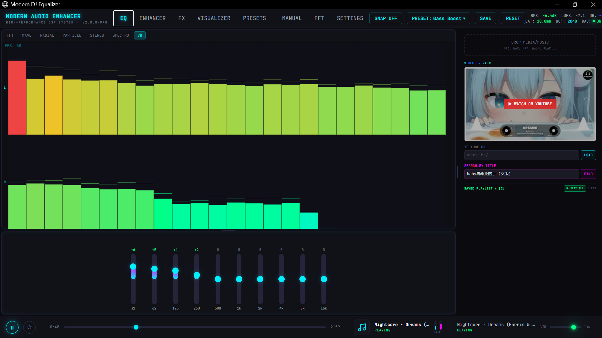
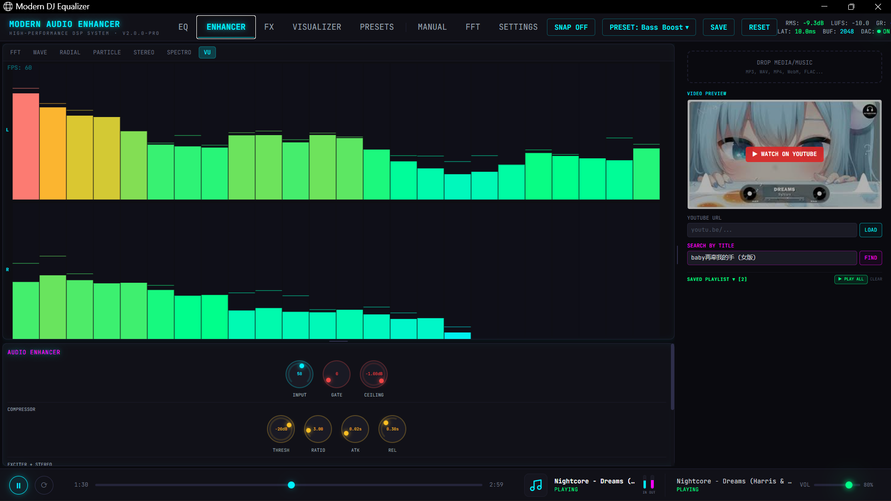
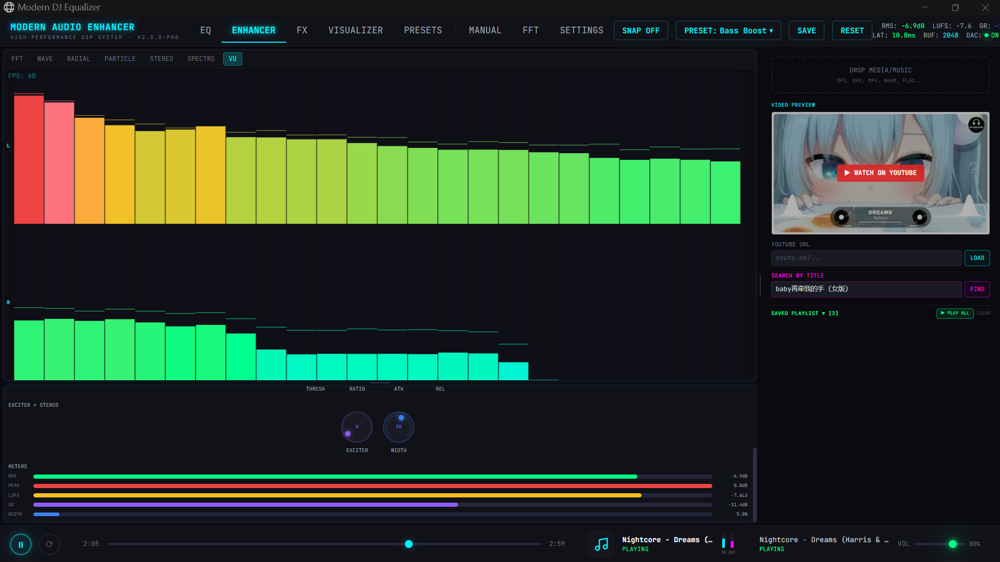
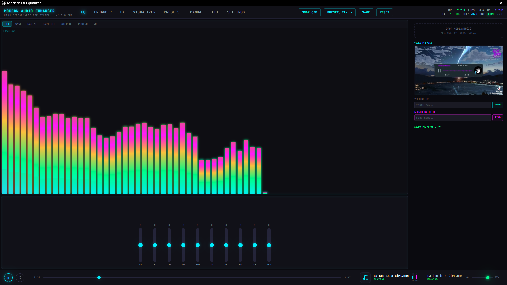
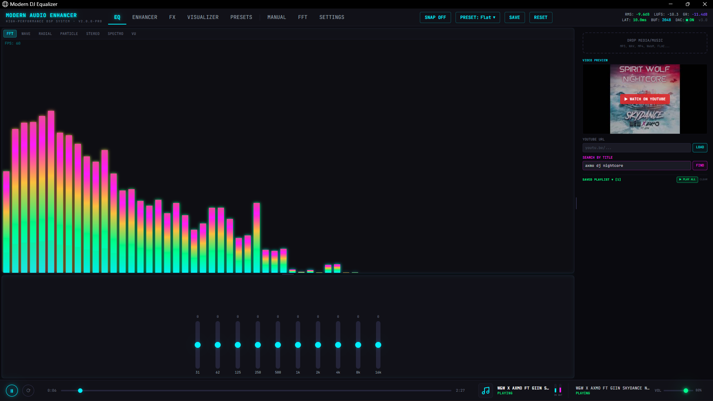
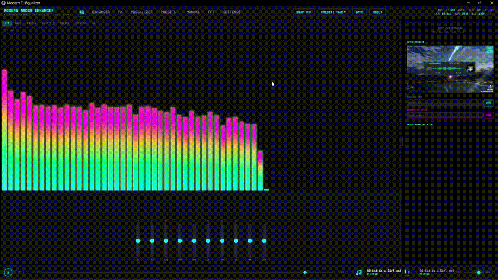
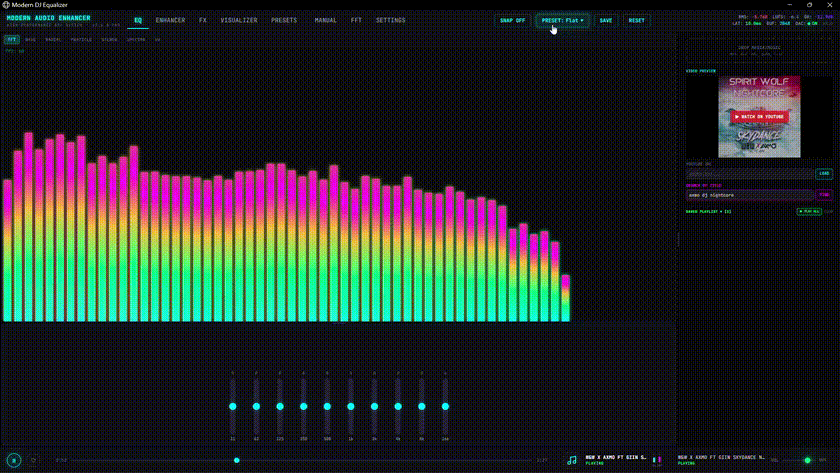

# Modern Audio Enhancer

Real-time audio workstation for EQ, DJ FX, visualization, and YouTube playback. It ships as a web app and a Tauri desktop app, with the same audio pipeline on both platforms.

<p align="center">
  
</p>

## Highlights

- 10-band EQ from 31 Hz to 16 kHz with snap mode and saved presets.
- Audio enhancer chain with input gain, gate, compressor, limiter, exciter, stereo widener, and live meters.
- DJ FX rack with bass, sweep filter, drive, echo, reverb, pan, auto pan, and pitch control.
- Seven visualization modes rendered on a Canvas 2D spectrum engine.
- Local file playback, video file audio extraction, YouTube URL extraction, and title search.
- Web and desktop runtimes share the same front-end code and DSP graph.

## Feature Gallery

### Screenshots

| Feature | Preview |
|---------|---------|
| Equalizer and visualization workspace |  |
| Audio enhancer controls |  |
| Audio enhancer meters |  |
| Local file workflow |  |
| YouTube search workflow |  |

### Demo GIFs

| Demo | Preview |
|------|---------|
| Local file workflow demo |  |
| YouTube workflow demo |  |

The GIFs are used in the README because they are lighter to preview on GitHub. The source MP4 recordings are kept in `assets/demos/` for future re-encoding.

## Feature Details

### Input and Playback

- Drag and drop local audio or video files into the input zone.
- Load YouTube audio by URL or search by title.
- Play a queue from search results or saved playlists.
- Preview local video files in the sidebar.

### Equalizer

- Ten fixed bands cover the full audible range used by the app.
- Snap mode rounds changes to 2 dB increments.
- Double-click resets a single band.
- Every band change uses a short linear ramp to avoid clicks.

### Audio Enhancer

- Input gain, noise gate, compressor, and limiter control the front of the chain.
- Exciter adds harmonic presence with a soft-clipping stage.
- Stereo widener uses mid/side processing.
- Live meters show RMS, peak, LUFS, gain reduction, and stereo width.

### DJ FX Rack

- Bass boost adds low-end weight without lifting the whole signal.
- Sweep filter supports low-pass, high-pass, and notch behavior.
- Drive, echo, reverb, pan, auto pan, and pitch changes are all exposed as fast controls.

### Visualization

- FFT, Wave, Radial, Particle, Stereo, Spectrogram, and VU modes are available.
- The canvas is scaled with device pixel ratio for sharper output on HiDPI displays.
- The render loop targets 60 FPS and degrades gracefully on smaller screens.

### Desktop Runtime

- Tauri desktop build with native updater support.
- File-based preset storage on desktop, localStorage in the web runtime.
- Asset protocol scope is restricted to the temp audio workspace.

## Supported Environments

| Platform | Status | Notes |
|----------|--------|-------|
| WSL2 | Supported | Best used with the Windows launcher or the web stack. |
| Linux | Supported | Works with the web stack and Tauri desktop build. |
| Windows | Supported | Use the launcher, Windows app session, or NSIS build. |

## Quick Start

```bash
git clone https://github.com/Wayan123/dj-equalizer-modern.git
cd dj-equalizer-modern
```

### Web App

```bash
./scripts/setup.sh
./scripts/dev.sh web
```

Open `http://localhost:5173`.

### Desktop App

```bash
./scripts/dev.sh tauri
```

### Windows

```bat
Start_DJ_Equalizer.bat
```

The batch launcher can open the WSL2 web stack, the Windows app session, or the Windows EXE build flow.

## Build

```bash
./scripts/build.sh web
./scripts/build.sh tauri
./scripts/build.sh exe
```

## Security and Safety

- YouTube URLs are validated before extraction.
- Stream URLs are restricted to trusted media hosts.
- YouTube endpoints are rate-limited.
- Uploaded files use sanitized file names and size limits.
- Tauri asset access is scoped to the temp audio workspace.
- Desktop updater artifacts are signed with a local key that is not stored in the repo.

## Documentation

- [User Manual](docs/user_manual.md)
- [Technical Manual](docs/technical_manual.md)
- [Project Memory](docs/project_memory.md)
- [Asset Guide](assets/README.md)
- [Contributing](CONTRIBUTING.md)
- [Security Policy](SECURITY.md)

## Project Layout

```text
dj-equalizer-modern/
├── frontend/         # React + Vite + TypeScript UI
├── backend/          # FastAPI backend for web runtime
├── frontend/src-tauri/ # Tauri desktop backend
├── assets/           # Screenshots in assets/images and demos in assets/demos
├── configs/          # Presets and app config
├── scripts/          # Cross-platform setup, run, build, clean scripts
├── docs/             # English manuals and project notes
└── tests/            # Frontend and backend tests
```

## Troubleshooting

- No audio output: click the page first because of browser autoplay policy.
- YouTube extraction fails: update `yt-dlp`.
- CORS errors in web mode: make sure the backend runs on port 8800.
- Blank canvas: open DevTools and inspect the console.
- High latency: use a smaller FFT size if you adjust the engine.
- Tauri build issues on Linux: install GTK/WebKit development packages.

## License

See [LICENSE](LICENSE).
